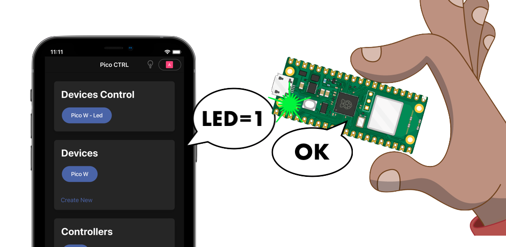

<h1 align="center"> Develop with Pico Ctrl using MicroPython</h1>
<p align="center">
  
</p>

Brief Set Up guide: https://pico.me365.xyz/steps

  ### (Step 1 - same) Set Up Pico Ctrl

  ### (Step 2 - different) Code with Pico W

  - Use `dev.uf2` file / or you can use [Latest .uf2](https://pico.me365.xyz/) and override on top!
  - Download IDE to access Pico, e.g. [Thonny IDE](https://thonny.org/)
  - Connect to your Pico W
  - Add `src` files to your Pico W, this handles each received command
  - Make some changes to handle new things e.g. create blink handle in handleCommands:

    `def handleCommands(item, value):`

    ```python
    if "blink" == item:
      blink_onboard_led(int(value))
    ```

    `...`

  - Rerun `main.py` after changes

  ### (Step 3 - similiar) Test Pico W Control with Pico Ctrl

  - Create new Controller for `your new commands`, e.g. use command `blink=5` and offCommand `led=0`
  - Update your device by enabling created command
  - Click on Control in Devices Control to emit new control command
